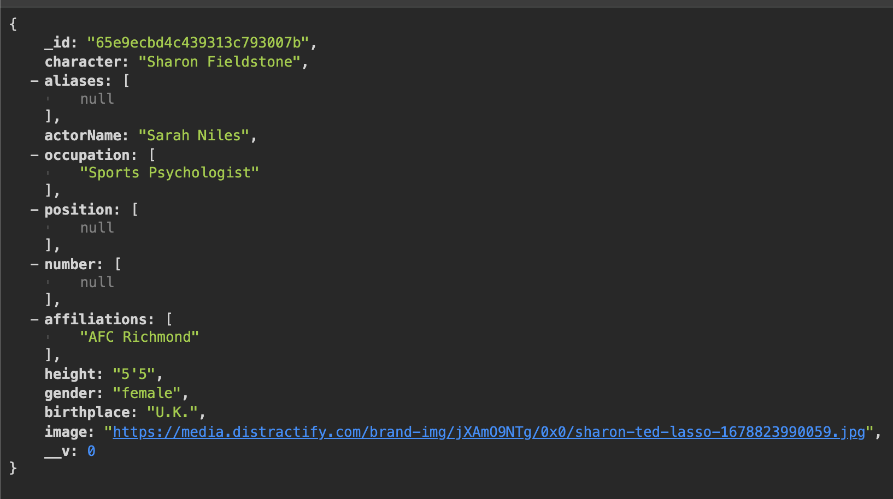

<h1>Ted Lasso API</h1>

## Introduction

Welcome to the Ted Lasso API! This database is a collection of various characters and quotes, as well as a full episode list, from the beloved Apple TV show, <em>Ted Lasso</em>.

This documentation will tell you more about this project and walk you through how to use this API.

Begin your journey by navigating to the deployed <a href="">Ted Lasso API</a>.


## Data Models

### Character Schema

| Field          | Type    | Description                                   |
| -------------- | ------- | --------------------------------------------- |
| character      | String  | The name of the character.                    |
| aliases        | String  | The nicknames of characters.                  |
| actorName      | String  | The actor who plays the character.            |
| occupation     | String  | The character's job.                          |
| position       | String  | The character's position on the football team. |
| number         | Number  | The character's jersey number.                |
| affiliations   | String  | The character's company/club affiliations.    |
| height         | String  | The character's height.                       |
| gender         | String  | The character's gender.                       |
| birthplace     | String  | The character's birthplace.                   |
| image          | String  | An image of the character.                    |

### Episode Schema

| Field          | Type    | Description                                   |
| -------------- | ------- | --------------------------------------------- |
| episodeName    | String  | Title of episode.                             |
| episodeNumber  | String  | The season the episode is in and the ep number. |
| description    | String  | Description of the episode.                   |
| imdbRating     | String  | IMDB rating (out of 10).                      |

### Quote Schema

| Field          | Type    | Description                                   |
| -------------- | ------- | --------------------------------------------- |
| quote          | String  | Quote by a character.                         |
| characterName  | String  | The character who said the quote.             |

## API Endpoints

### GET

To get a list of all characters, the endpoint is "/characters". Example:

```
http://localhost:4000/characters
```

To get a list of all episodes, the endpoint is "/episodes". Example:

```
http://localhost:4000/episodes
```

To get all quotes, the endpoint is "/quotes".
Example:

```
http://localhost:4000/quotes
```

You can also access individual characters by their character name or by their actor's name. The endpoints would look something like the examples below.

Character name ("/characters/character/character name"):

```
http://localhost:4000/characters/character/Ted%20Lasso
```

Actor name ("/characters/actor/ actor name"):

```
http://localhost:4000/characters/actor/Sarah%20Niles
```

The response for either of the above examples will look something like this:

</img>


## Technology Used

<li><a href="https://developer.mozilla.org/en-US/docs/Web/HTTP/CORS">CORS</a></li>
<li><a href="https://expressjs.com/">Express</a></li>
<li><a href="https://www.heroku.com/?utm_source=google&utm_medium=paid_search&utm_campaign=amer_heraw&utm_content=general-branded-search-rsa&utm_term=heroku&gad_source=1&gclid=CjwKCAiAxaCvBhBaEiwAvsLmWIODeYAx0sDtALxO4HmrZ01pH2mHJl_tPb6sXLFuT39og4AgMDBlwxoCmb0QAvD_BwE">Heroku</a></li>
<li><a href="https://www.mongodb.com/docs/mongodb-shell/">Mongosh</a></li>
<li><a href="https://www.mongodb.com/docs/mongodb-shell/">MongoDB</a></li>
<li><a href="https://www.npmjs.com/package/morgan">Morgan</a></li>
<li><a href="https://www.postman.com/">Postman</a></li>


## Additional Resources

<li><a href="https://ted-lasso.fandom.com/wiki/Ted_Lasso_Wiki">Ted Lasso Wiki</a></li>
<li><a href="https://tv.apple.com/us/show/ted-lasso/umc.cmc.vtoh0mn0xn7t3c643xqonfzy?mttn3pid=Google%20AdWords&mttnagencyid=a5e&mttncc=US&mttnsiteid=143238&mttnsubad=OUS2019863_1-688167383417-c&mttnsubkw=105373391198__wAojZMzu_&mttnsubplmnt=_adext_">Ted Lasso Apple TV</a></li>
<li><a href="https://www.imdb.com/title/tt10986410/episodes/?season=1">Ted Lasso IMDB Episode List</a></li>


